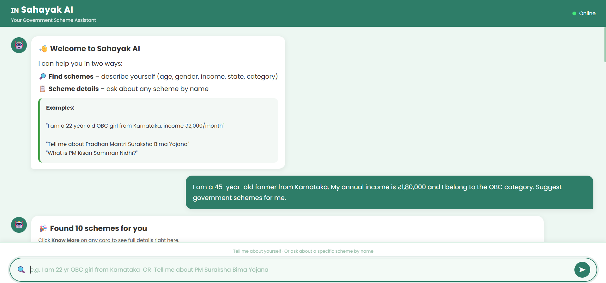
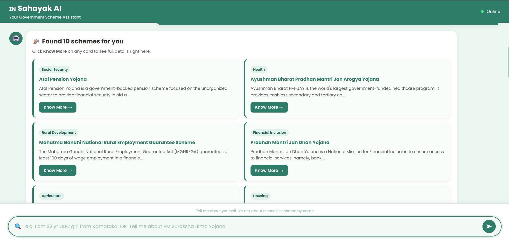
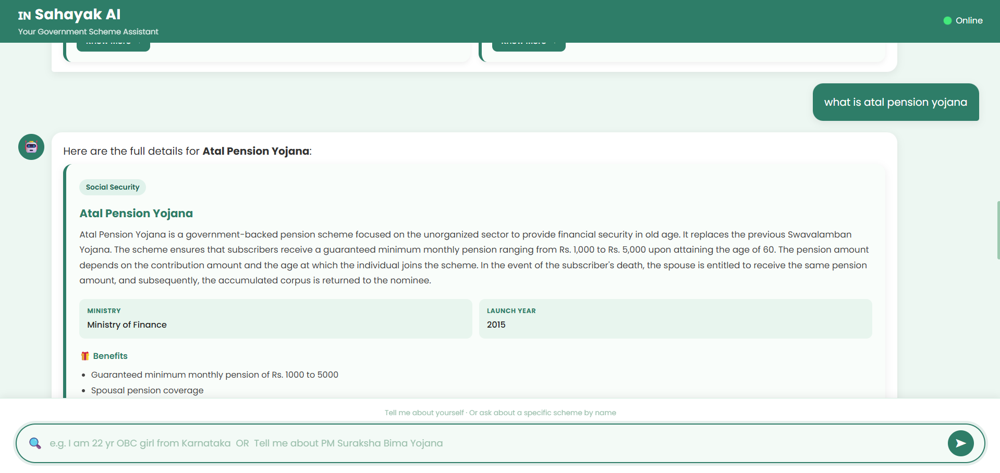

# 🇮🇳 Sahayak AI – National Government Schemes Guidance Platform

### 🤖 AI-Powered Government Scheme Recommendation Assistant

> Helping Indian citizens discover the right government welfare schemes through **Conversational AI**, **Natural Language Processing**, and **Large Language Models (LLMs)**.


---

# 📸 Project Preview


## 💬 User Query



---

## 🎯 Recommended Government Schemes



---

## 📄 Scheme Details



---

# 📌 Overview

Finding the right government welfare scheme is often difficult because information is scattered across multiple government portals, making the process time-consuming and confusing.

**Sahayak AI** solves this problem by providing an intelligent conversational assistant that understands natural language and recommends personalized government schemes based on the user's profile.

Instead of filling long forms, users simply type naturally.

### Example

> "I am a 22-year-old female student from Karnataka. My annual income is ₹2,000 and I belong to the OBC category. Suggest government schemes."

The AI automatically understands the user's profile and recommends eligible government schemes instantly.

---

# 🚀 Features

✅ Conversational AI Chatbot

✅ Natural Language Query Processing

✅ Automatic Profile Extraction

✅ Personalized Government Scheme Recommendation

✅ Education Scheme Guidance

✅ Agriculture Scheme Guidance

✅ Healthcare Scheme Guidance

✅ Old Age Pension Scheme Guidance

✅ Women Empowerment Schemes

✅ Housing & Financial Assistance Schemes

✅ Required Documents

✅ Application Process

✅ Official Government Website Links

✅ Follow-up Questions on Individual Schemes

---

# 🤖 Artificial Intelligence

Sahayak AI combines **Natural Language Processing (NLP)** with **Large Language Models (LLMs)** to create an intelligent assistant capable of understanding user queries and generating personalized recommendations.

### AI Technologies Used

### 🧠 Natural Language Processing (NLP)

The chatbot understands free-form user input and extracts important information such as:

- Age
- Gender
- State
- Occupation
- Annual Income
- Social Category

without requiring users to fill lengthy forms.

---

### ⚡ Groq Cloud

Groq provides ultra-fast inference for Large Language Models, enabling real-time conversational responses with very low latency.

---

### 🦙 Meta Llama 3.1

Meta's Llama model is used to:

- Understand natural language
- Interpret user intent
- Generate personalized recommendations
- Answer follow-up questions about government schemes

---

# 🧠 AI Workflow

```
             User
               │
               ▼
Natural Language Query
               │
               ▼
Natural Language Processing
(Profile Extraction)
               │
               ▼
FastAPI Backend
               │
      ┌────────┴─────────┐
      ▼                  ▼
Government Scheme     Groq + Llama
     Database               AI
      │                  │
      └────────┬─────────┘
               ▼
 Eligibility Matching Engine
               │
               ▼
 Personalized Recommendations
               │
               ▼
 Chatbot Response
```

---

# ⚙️ Tech Stack

## Frontend

- HTML5
- CSS3
- JavaScript

---

## Backend

- Python
- FastAPI

---

## Artificial Intelligence

- Groq Cloud
- Meta Llama 3.1
- Natural Language Processing (NLP)

---

## Data Processing

- JSON Dataset
- Rule-based Eligibility Matching
- Conversational AI

---

# 📂 Project Structure

```
SahayakAI
│
├── backend
│   ├── main.py
│   ├── parser.py
│   ├── recommender.py
│   ├── groq_service.py
│   ├── models.py
│   ├── schemes.json
│
├── frontend
│   ├── index.html
│   ├── style.css
│   ├── script.js
│
├── images
│   ├── home.png
│   ├── query.png
│   ├── recommendation.png
│   ├── details.png
│
├── README.md
└── requirements.txt
```

---

# 📊 Government Data Sources

The government scheme dataset has been collected and structured from official Government of India portals including:

- https://www.myscheme.gov.in
- https://www.india.gov.in
- https://pmkisan.gov.in
- https://scholarships.gov.in
- https://pmjay.gov.in
- https://pmaymis.gov.in

The dataset contains:

- Scheme Name
- Description
- Eligibility
- Benefits
- Required Documents
- Application Process
- Ministry
- Official Website

---

# 💻 Installation

Clone the repository

```bash
git clone https://github.com/YOUR_GITHUB_USERNAME/SahayakAI.git
```

Go to project directory

```bash
cd SahayakAI
```

Create Virtual Environment

```bash
python -m venv .venv
```

Activate

Windows

```bash
.venv\Scripts\activate
```

Install dependencies

```bash
pip install -r requirements.txt
```

Run FastAPI

```bash
uvicorn main:app --reload
```

Open

```
http://127.0.0.1:8000
```

---

# 💬 Example Conversation

### User

```
I am a 22-year-old female student from Karnataka.

My annual income is ₹2,000.

I belong to the OBC category.

Suggest government schemes.
```

### AI

✅ National Scholarship Portal

✅ AICTE Pragati Scholarship

✅ PM Yasasvi Scholarship

✅ Sukanya Samriddhi Yojana

Users can also ask follow-up questions like:

- Explain PM-KISAN.
- What are the eligibility criteria for Ayushman Bharat?
- What documents are required for PMAY?
- How can I apply for PM Kisan?

The chatbot responds with detailed information including benefits, required documents, eligibility, application process, and the official government website.

---

# 🌟 Future Enhancements

- 🎤 Voice Assistant
- 🌐 Multilingual Support
- 📱 Android Application
- 📄 OCR Document Verification
- 🔔 Personalized Notifications
- 🤝 Human Assistance Integration
- 🧾 Eligibility Prediction
- 🛰️ Real-time Government API Integration

---

# 🏆 Hackathon Evaluation Mapping

| Evaluation Criteria | Implementation |
|----------------------|----------------|
| AI Agent Functionality | Conversational AI chatbot recommending schemes |
| Innovation & Creativity | Natural language based scheme discovery |
| Technical Implementation | FastAPI + Groq + Llama + NLP |
| Agent Autonomy | Automatically extracts user profile and recommends schemes |
| Real-World Impact | Makes government welfare schemes more accessible |
| Demo Quality | Interactive chatbot with follow-up conversations |

---

# 🌍 Impact

Sahayak AI simplifies access to government welfare schemes by enabling citizens to interact with an intelligent assistant instead of navigating multiple government websites.

The platform aims to bridge the information gap and improve awareness of education, healthcare, agriculture, pension, women empowerment, housing, and financial assistance schemes.

---

# 👩‍💻 Developed By

## **Aisshwarya Gurav**

Artificial Intelligence & Data Science Student

🚀 Passionate about Artificial Intelligence, Machine Learning, NLP, and Full-Stack Development.

### Project

**Sahayak AI – National Government Schemes Guidance Platform**

Built for **Hackathon 2026** 🚀

---

# ⭐ If you like this project

Give this repository a ⭐ on GitHub!

---
